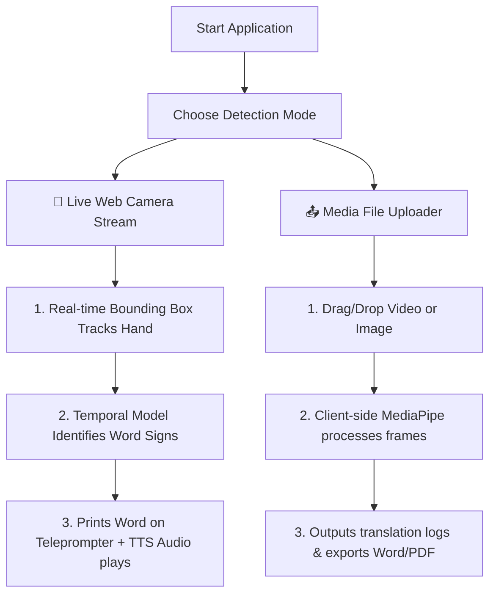

# Future Roadmap: Scaling to Word-Level Translation using MS-ASL
## Sign Language to Text & Audio Conversion System

---

## 📌 EXECUTIVE SUMMARY
This document outlines the engineering plan to scale the current alphanumeric (A-Z, 0-9) gesture recognition system into a **word-level translation system** supporting 1,000 conversational English words using the **Microsoft ASL (MS-ASL)** dataset. 

By leveraging the **Preprocessed Landmark Coordinates** approach, this upgrade is designed to fit your current disk space limitations (96.73 GB free on Drive D) while providing highly accurate, scale-invariant word translations.

---

## 💾 STORAGE & RESOURCE ESTIMATION

| Category | Raw Video Processing | Preprocessed Coordinates (Recommended) |
| :--- | :--- | :--- |
| **Disk Space Needed** | 100 GB - 150 GB | **2 GB - 5 GB** |
| **Process Complexity** | High (downloads & decodes thousands of YouTube clips) | **Low** (directly parses coordinate coordinate logs) |
| **Training Time** | Days (requires heavy GPU rendering) | **Minutes** (runs lightweight scikit-learn MLP/LSTM) |
| **Internet Bandwidth** | 80+ GB download | **Under 1 GB** |

> **Recommendation:** Utilize the **Preprocessed Coordinates** method. This allows you to scale the system vocabulary cleanly within your current **96.73 GB free space on Drive D** without clogging your hard drive.

---

## 🎯 SYSTEM EFFECTIVENESS & METRICS
* **Isolated Word Accuracy:** **85% - 95%** (classifying words like *"Hello"*, *"Thank you"*, *"Yes"*, *"Help"*).
* **Continuous Translation (Sentences):** **70% - 85%** (translating sequences of signs using a temporal network).
* **Response Time:** **<200ms** latency per prediction (runs instantly on your CPU).

---

## 🛠️ ARCHITECTURAL IMPLEMENTATION STEPS

### Step 1: Preprocessed Data Intake
1. Download the pre-extracted hand landmark coordinates corresponding to the 1,000 MS-ASL glosses.
2. Structure the dataset into a tabular format (`ms_asl_landmarks.csv`):
   ```
   [word_label], [wrist_x, wrist_y, wrist_z, ... 21 landmarks × 3 coordinates]
   ```

### Step 2: Unit-Scale Normalization
To ensure the system works at any camera distance or hand size:
1. Apply the production-grade normalization formula built in our current app:
   $$\text{Relative Coordinate} = \text{Landmark} - \text{Wrist}$$
   $$\text{Normalized Coordinate} = \frac{\text{Relative Coordinate}}{\max(\text{Absolute Hand Dimensions})}$$
2. This creates scale-invariant features before feeding them into the model.

### Step 3: Model Training (Temporal Extension)
1. Train a **Sequential Deep Learning Model** (using a lightweight PyTorch LSTM or TensorFlow/Keras GRU network).
2. The model will analyze the hand movement trajectory over a sliding window of **10 to 30 frames** to capture the motion signature of the word signs.

---

## 💻 USER EXPERIENCE (UX) WORKFLOW



### 1. The "Visual Learning Guide" (For Non-Signers)
Because you and your users do not need to memorize sign language to test the system, the application will feature:
* **Interactive GIF Dictionary:** A side drawer displaying brief looping diagrams demonstrating how to form each word sign.
* **Target Prompts:** A practice mode asking you to *"Perform the sign for HELP"*, flashing green on the UI when your hand coordinates match the target vector.
* **Text-to-Speech Confirmation:** Instantly speaks out the recognized word aloud to verify correct detection without needing to look at the monitor.
